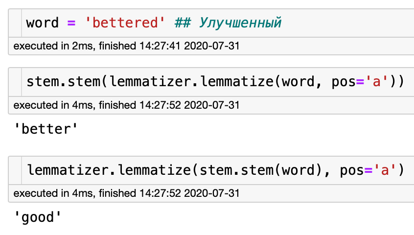
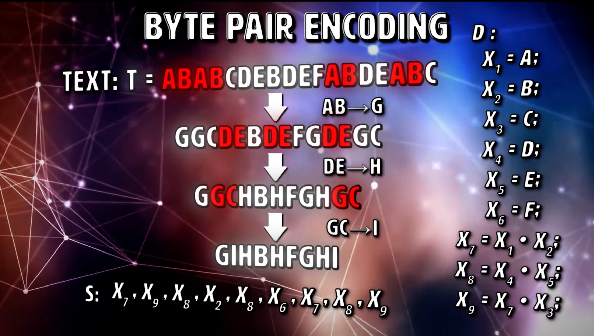
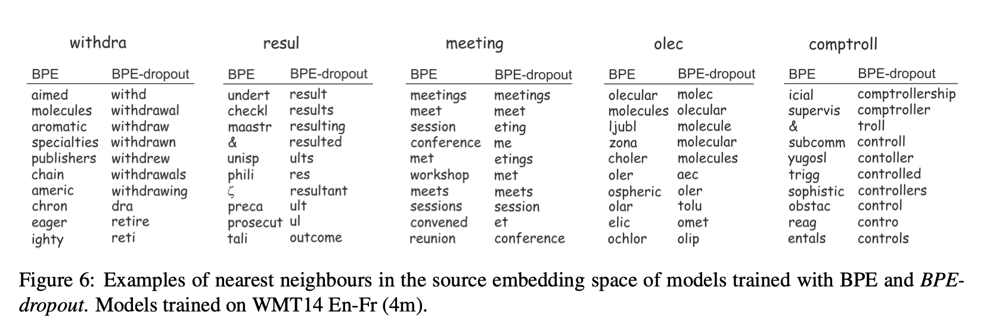

# Text Processing
Подготовка текстовых данных является одной из важнейших операций в анализе
текстовых данных.

Чаще всего модели текстового анализа данных основываются на использовании
словаря. И, как правило, чем больше словарь, тем больше ресурсов необходимо
для обучения модели. И тогда на поверхности появляется проблема, а именно: слова
в разных контекстах, имеющие один и тот же смысл, могут писаться по-разному.
Например:
- *мама* должна *была* вымыть раму.
- *маме* необходимо *было* вымыть раму.

Как видно, слова *мама/маме* и *была/было* несут один и тот же смысл,
но при этом имеют разные окончания и поэтому считаются разными словами.

Если мы хотим облегчить работу нашего алгоритма, мы должны подсказать, что
слова *мама/маме* (*была/было*) на самом деле имеют одинаковое значение и
не нужно рассматривать их по-разному.

Либо каким то образом сообщить о том, что слова одинаковые, но отличаются только
окончанием, то есть разбить слова на *токены*, а именно: *мама = [мам, а]*,
*маме = [мам, е]*. При таком подходе, мы сохраняем информацию о том, что за
слово было изначально, так как из токенов можно собрать слово обратно, но при
этом нам нет необходимости хранить отдельно различные формы слов, так как мы
будем хранить просто токены, которые могут подходить для множества слов.

## Lemmatization, Stemming

**Лемматиза́ция** — процесс приведения словоформы к лемме — её нормальной
(словарной) форме. Часто зависит от контекста слова в предложении.

**Сте́мминг** — это процесс нахождения основы слова для заданного
исходного слова.

- В русском языке нормальными формами считаются следующие морфологические формы:
    - для существительных — именительный падеж, единственное число;
    - для прилагательных — именительный падеж, единственное число, мужской род;
    - для глаголов, причастий, деепричастий — глагол в инфинитиве
      несовершенного вида.
- Пример лемматизации в русском языке:
    - кошками → кошка
    - бежал → бежать
    - боязненных → боязненный
- Пример лемматизации в английском языке:
    - better → good
    - walking → walk
    - meeting → Зависит от контекста
        - Если это существительное → meeting
        - Если это глагол → meet
    

- Стемминг в русском языке
    - основой слова является все, кроме окончания, поэтому операция
      стемминга для русского — удаление окончаний.

Важно понимать, что для конкретной задачи необходимо делать.
- *Стемминг*: Например предложение: 'Маша сделала Паше подарок.' В таком
  предложении, легко понять кто сделал подарок, так как есть окончание 'a' у
  слова 'сделал', то это означает что подарила Маша. Это можно было понять и по
  смыслу, но если есть окончания то для алгоритма будет гораздо проще делать
  логические связи. В таком случае, можно не делать *Стемминг*.
- *Лемматизация*: Если в задаче важно время, в котором происходят действия, то
  после лемматизации задача усложнится в несколько раз, например
  бежал → бежать. В таком случае, можно не делать *Лемматизацию*.
- *Стемминг* и *Лемматизация*: На примере ниже видно, если брать слово
  'bettered', и пробовать его лемматизировать, то скорее всего ничего не
  изменится. И после стемминга, уйдет окончание и получится слово 'better'. Если
  делать в другом порядке, то сперва мы обрубим окончание от слова 'bettered',
  и дальше лемматизация сможет преобразовать слово 'better' → 'good'. Поэтому,
  чаще всего, лучше делать стемминг, а после него делать лемматизацию.

## Tokenization
**Токенизация** — разбиение данных на элементарные части (токены):
- Слова
- Буквы
- n-граммы

Предложение можно разбивать на слова, буквы, n-граммы. Но у этого подхода также
есть свои недостатки.

- Разбиение на слова:
    - Данное разбиение будет раздувать словарь токенов. (*мама/маме/маму/...*)
- Разбиение на буквы:
    - Данное разбиение имеет право на существование, но словарь будет очень
      маленький и все ляжет на плечи модели, которая должна быть достаточно
      мощной, с точки зрения архитектуры и способности агрегировать информацию
      от большого числа токенов, чтобы показывать хорошие результаты.
- Разбиение на n-граммы:
    - Данное разбиение решает частично проблемы, описанные выше, но при этом не
      все разбиения получаются осмысленными. Например, при n=3, слово *'привет'*
      будет разбито на токены *['при', 'вет']*, хотя данное слово можно было бы
      добавить в словарь, так как оно чаще всего встречается в такой форме, и
      понимать важность этого слова для задачи сразу, а не агрегируя ее от
      других токенов, усложняя задачу алгоритму машинного обучения. Или например
      слово "subword", хочется разбить на "sub" и "word" - отдельные токены, но
      при любом "n" такое разбиение сделать не получится. Данное разбиение может
      быть полезным, так как мы не потеряли смысл этого слова, и в то же время
      решаем проблему Out-of-vocabulary, для слова "subtask", - такого слова при
      обучении может не быть, и если анализировать его целиком, мы столкнемся с
      трудностями. Но если у нас был токен "sub", от разбиения слова "subword",
      то мы легко получим слово "subtask" из токенов "sub" и "task".

## Subword tokenization
На данный момент это лучшая техники токенизации последовательности символов,
которая решает перечисленные выше проблемы, и при этом может варьировать размер
словаря.

### BPE

#### Алгоритм **Byte Pair Encoding (BPE)**

- Обучение:
    1) Создадим *Token Vocabulary* и *Merge Table*. *Token Vocabulary*
       инициализируется словарем символов, а *Merge Table* инициализируется
       пустой таблицей.
    2) Каждое слово представляется в виде последовательности токенов (в начале
       токен == символ) плюс специальный токен конца слова.
    3) Назначаем новым токеном объединение двух существующих токенов, которое
       встречается чаще других пар в корпусе (имеется в виду: встречаются
       вместе). Этот токен добавляется в *Token Vocabulary*, операция слияния
       добавляется в *Merge Table*.
    4) Проверяем достигается ли ограничение на размер словаря и частоту
       встречаемости новой пары. Если ограничения не достигнуты, то повторяем
       пункты 3-4.

Результирующая *Merge Table* указывает, какие подслова должны быть объединены
в более крупное подслово, а также приоритет слияний. Приоритет определяется тем,
на какой позиции стоит слияние в *Merge Table*, то есть, чем раньше появилось
такое слияние при обучении, тем выше у нее приоритет.

- Применение:
    1) Слова разбиваются на символы, и к каждому слову добавляется символ конца
       слова.
    2) Все символы будем считать токенами.
    3) Идем по merge table (сверху вниз), и проверяем, можем ли мы сделать
       слияние двух токенов.
    4) Если находим → делаем слияние токенов, получаем новый набор токенов →
       повторяем пункт (3-4) сначала. Если нет, то возвращаем токены, которые
       получились.

### WordPiece
Данный алгоритм основывается на **BPE**, но при этом меняется пункт (3) в
обучении. Создание нового токена происходит не на основе частоты встречаемости,
а на основе максимального правдоподобия. Что это значит? Например, "u", за
которым следует "g", были бы объединены только в том случае, если вероятность
"ug", разделенная на вероятности "u" и "g" была бы больше, чем для любой другой
пары символов. Интуитивно, WordPiece немного отличается от BPE тем, что он
оценивает, что теряет, объединяя два токена, чтобы убедиться, что оно того
стоит.

### BPE-Dropout
На этапе применения можно делать своего рода dropout.
В пункте (3), до того как делаем поиск по таблице слияний, проходимся по каждой
паре слияний и удаляем пару вероятностью *p*
([Авторы статьи](https://arxiv.org/pdf/1910.13267.pdf) берут *p=0.1*).
Затем делаем поиск, и восстанавливаем таблицу слияний обратно. Как утверждают
авторы подхода, это позволяет добавить еще один тип регуляризации, повысить
стабильность алгоритма, обученного на этих токенах. Ниже приведен интересный
пример из статьи:

Представлены 5 слов, и самые близкие к ним слова (по расстоянию между
эмбеддингами). Колонка слева для каждого слова — обучение с обычным *BPE*,
колонка справа - с *BPE — dropout*. Видно, что второй подход лучше может похожим
словам давать похожий вектор, за счет dropout, который заставлял алгоритм
выучивать разные разбиения одного слова.

### Unigram
Отличается от предыдущих техник тем, что вместо добавления новых токенов в
словарь, алгоритм удаляет токены из словаря.

#### Алгоритм **Unigram**
- Обучение:
    1) Создать большой словарь (любой эвристикой – например *BPE* с большим
       словарем).
    2) Для каждого токена *token* вычислить *loss_token* – насколько уменьшится
       правдоподобие при удалении токена из словаря.
    3) Оставить *K%* токенов с максимальным *loss_token* (символы оставлять
       всегда, чтобы не было *OOV* проблемы).

*loss_token* - на сколько насколько уменьшится правдоподобие при удалении токена
из словаря.

*K* выбирается обычно порядка 80-90.

- Применение:
    1) Так как нет таблицы объединения, можем взять все множество разбиений,
       которые есть в последовательности. Разбиваем полученную
       последовательность на всевозможные комбинации токенов. Например, если
       словарь состоит из таких токенов: *["b", "g", "h", "n", "p", "s", "u",
       "ug", "un", "hug"]*, и нам необходимо разбить слово *"hugs"*, то
       всевозможные разбиения для этого слова: *["hug", "s"], ["h", "ug", "s"],
       ["h", "u", "g", "s"]*.
    2) У каждого разбиения есть своя вероятность — произведение вероятности
       токенов, из которых оно состоит. Посчитаем вероятность каждого разбиения,
       и выберем максимальное либо отноримруем и сэмплируем с полученными
       весами.
       

Важные замечания:
- **Subword Tokenization** способна разбить любой текст на токены, если в этом
  тексте все символы (весь алфавит) есть в словаре. **Subword Tokenization**
  может разбить слова, которых никогда не видел. Чаще всего алгоритм будет
  разбивать незнакомые слова на под-слова, которые видел, пример "subtask" →
  ["sub", "task"].
- Если обучаем *мультиязычную модель*, то лучше использовать
  **Byte-level Subword Tokenization**, а именно переводить текст в байты,
  и работать с ними. Такой подход используется в GPT2. Это нужно для того,
  что бы проще было работать например с китайскими символами и английскими
  одновременно, потому что китайские символы хранят в себе больше информации,
  чем символы в английском, и при этом в памяти иероглифы занимают так же
  больше памяти, поэтому лучше в таких ситуациях использовать **Byte-level
  Subword Tokenization**.

- На практике, стараются различать не только конец слова, но и понимать
  самостоятельный ли токен, или нет. Пример → "I like ke" → ['I', 'li', '##ke',
  'ke']. Токены "##ke" и "ke" разные, понятно что они несут разный смысл,
  один это часть составного слова, другой — отдельное слово. В итоге есть
  несколько способов, либо добавлять как по канону символ конца слова, либо
  добавлять спецсимвол к токену спереди, что бы понимать что он принадлежит
  предыдущему слову.

## Basic Cleanup
- Иногда, в качестве предобработки текста, необходимо:
    - Очистить текст от спец. символов
      ('\n', '\t', punctuation, XML/HTML tags, etc). Это необходимо делать для
      облегчения работы алгоритма, так как зачастую такие символы не несут в
      себе смысловой нагрузки, но при этом алгоритм должен уметь их
      обрабатывать, хотя в этом нет необходимости.
    - Привести весь текст в один (нижний) регистр. Данная техника может
      позволить уменьшить словарь за счет того, что слова в разном регистре,
      но состоящие из одних и тех же букв, (Мама/мама) будут рассматриваться как
      одно слово, что сократит размер словаря и может увеличить обобщающую
      способность алгоритма.
    - Заменять специальный текст на специальные символы, таким образом можно
      облегчить работы алгоритма, если ему не придется обрабатывать, к примеру
      мобильный телефон, а сразу сказать ему о том, что эта последовательность
      символов — мобильный телефон:
        - Links, Urls — \<url>
        - Emails — \<email>
        - Phone number — \<phone>
        - Number — \<number>
        - Currency — \<currency>
        - ...
    - Исправить опечатки. Это помогает более корректно обрабатывать текстовые
      данные, из-за того, что слово будет восприниматься так, как и должно быть,
      а не разбиваться на маленькие токены, из-за того, что такого слова нет в
      словаре из-за ошибки в написании.

## Some tricks
1) Аббревиатуры
    - Делайте расшифровку аббревиатур, так гораздо легче дать осмысленный 
      эмбеддинг для аббревиатуры. 'доп' → 'дополнительно', 'devops' →
      'development operations', и т. д.
2) Приставки *не/ни*.
    - Добавляйте приставки 'не' и 'ни' к впереди идущим словам. Это помогает
      лучше понимать, к какому слову относится отрицание. (Зависит от задачи).
3) Удаляйте стоп-слова.
    - Стоп-слова зачастую не несут смысловой нагрузки, поэтому их можно
      удалять. (Зависит от задачи).
4) Если ресурсы позволяют, можно к словам добавлять UDPipe теги. Это может
   помочь, когда одно и то же слово может быть разными частями речи в
   зависимости от контекста, например: 'печь' это слово может быть как
   существительным, так и глаголом - 'русская печь' / 'печь пирожки'. Для
   модели может быть полезно, если все слова будут иметь теги, например:
   'печь_NOUN' / 'печь_VERB'.
5) При использовании **Subword Tokenization** необязательно делать
   **Lemmatization** и **Stemming**. Так как эти предобработки были направлены
   на сокращение словаря, а в **Subword Tokenization** мы можем варьировать
   словарь, при этом не теряя информацию о последовательности, в отличие от
   использования **Lemmatization** и **Stemming**, где теряется часть информации
   из последовательности.
6) Используйте **Subword Tokenization** вместо обычной токенизации, даже если
   вы не используете нейронные модели.

### Ссылки
- [КвазиНаучный блог Александра Дьяконова. Токенизация на подслова.](https://dyakonov.org/2019/11/29/токенизация-на-подслова-subword-tokenization/)
- [Stanford. Lemmatization and Stemming.](https://nlp.stanford.edu/IR-book/html/htmledition/stemming-and-lemmatization-1.html)
- [Stanford. Tokenization.](https://nlp.stanford.edu/IR-book/html/htmledition/tokenization-1.html)
- [Хабр. Основы Natural Language Processing для текста.](https://habr.com/ru/company/Voximplant/blog/446738/)
- [Wikipedia. Лемматизация](https://ru.wikipedia.org/wiki/%D0%9B%D0%B5%D0%BC%D0%BC%D0%B0%D1%82%D0%B8%D0%B7%D0%B0%D1%86%D0%B8%D1%8F)
- [Wikipedia. Стемминг](https://ru.wikipedia.org/wiki/%D0%A1%D1%82%D0%B5%D0%BC%D0%BC%D0%B8%D0%BD%D0%B3)
- [Huggingface. Summary of the tokenizers.](https://huggingface.co/transformers/tokenizer_summary.html)
- [Arxiv. BPE-Dropout](https://arxiv.org/pdf/1910.13267.pdf)
