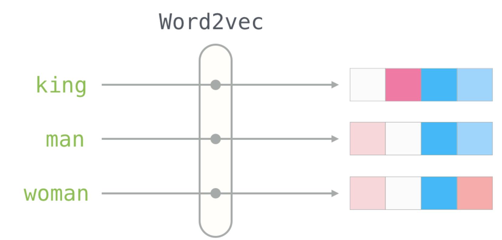
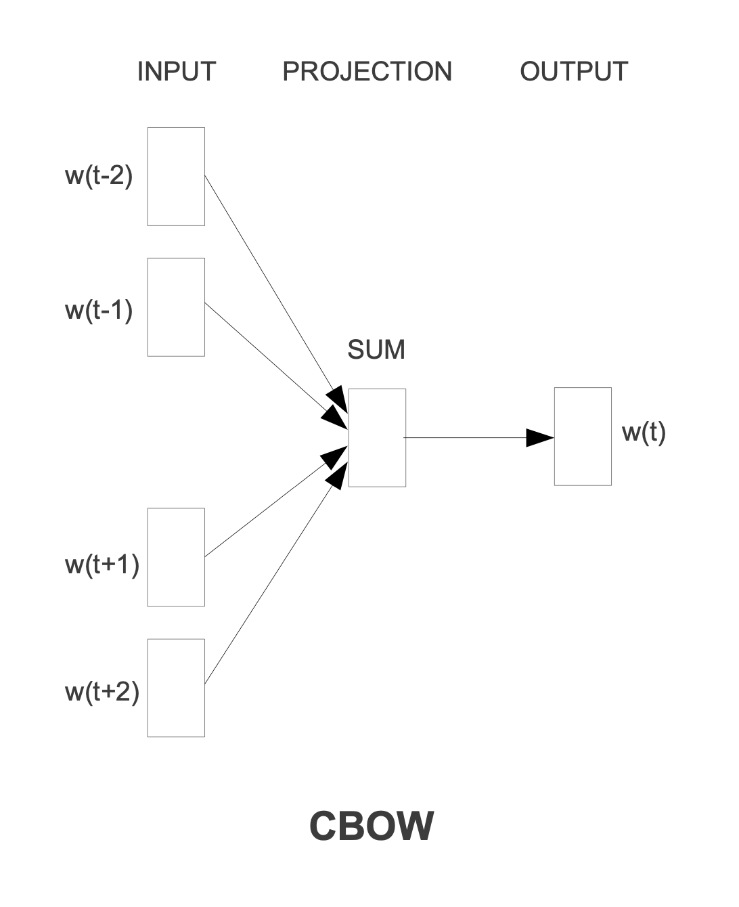
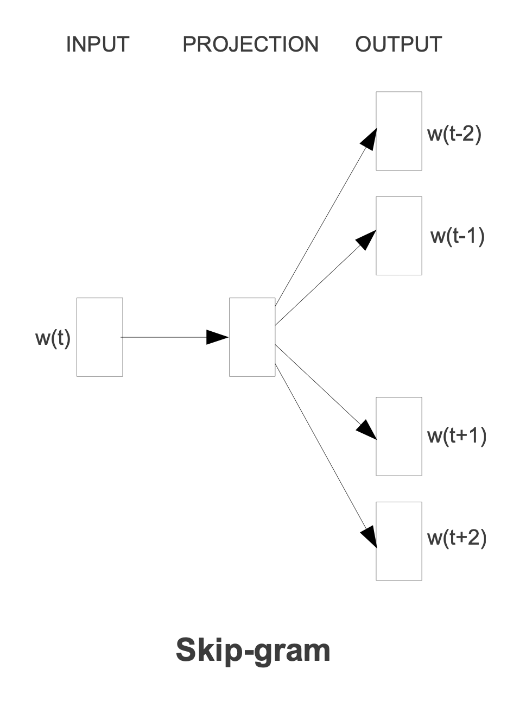
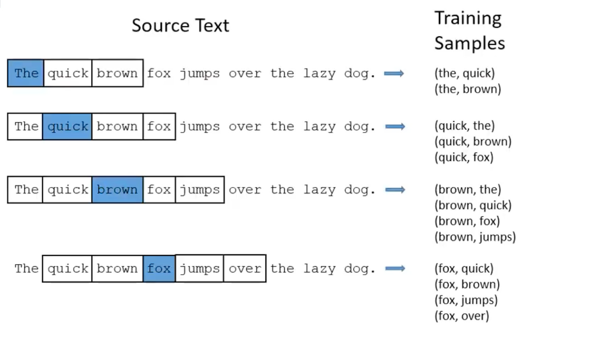
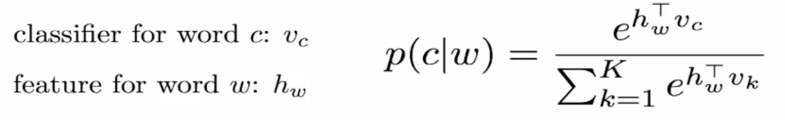

# Word Embeddings

## Word2Vec
**Word2Vec** — Совокупность методов, которые для слов сопоставляют некоторые
вектора (Embeddings).



Так же так называют один из методов получения таких векторов.

Хочется без специально размеченной выборки выучить хорошие векторные
представления для слов. Подход **Word2Vec** для этого использует корпус текста,
и для каждого слова в корпусе, на основе контекста, выучивает вектора.

Есть два основных подхода обучения **Word2Vec**:

- **CBOW (Continuous Bag-of0Words)** — По контексту предсказать слово
- **Skip-Gram** — По слову предсказать контекст

### CBOW



Модель представляет собой двухслойную нейронную сеть.

Итерируемся по тексту с шагом *1* и окном *N*. Пусть *N=4* (*2* слова слева и 
*2* справа от текущего).

Первый слой принимает на вход слова, которые находятся в контексте текущего
слова.

Это можно реализовать либо передавая *N* индексов слов, либо подавая вектор,
размерности словаря — *V*, где везде будут нули, кроме $N$ индексов, которые
означают слова-контекст.

Рассмотрим второй способ. Получив такой вектор, мы можем подать его в линейный
слой, после чего мы получим вектор, размером *H* (скрытое состояние). Далее,
этот вектор мы подаем в следующий линейный слой, где получаем вектор,
размерности *V*. И тагретом будет текущее слово, то есть one-hot вектор, либо
индекс текущего слова.

```python
from torch import nn

class Word2Vec(nn.Module):
    def __init__(self, vocab_size, hidden_size):
        super.__init__()
        self.linear1 = nn.Linear(vocab_size, hidden_size)
        self.linear2 = nn.Linear(hidden_size, vocab_size)

    def forward(self, x):
        ## x.shape == (batch_size, vocab_size)
        x = self.linear1(x)

        ## x.shape == (batch_size, hidden_size)
        x = self.linear2(x)

        ## x.shape == (batch_size, vocab_size)
        return x
    
    def get_embedding(self, x):
        return self.linear1(x)

```

Либо, используя индексы в качестве входа:
```python
from torch import nn

class Word2Vec(nn.Module):
    def __init__(self, vocab_size, hidden_size):
        super.__init__()
        self.embedding = nn.EmbeddingBag(vocab_size, hidden_size, mode="sum")
        self.linear = nn.Linear(hidden_size, vocab_size)

    def forward(self, x):
        ## x.shape == (batch_size, window_size)
        x = self.embedding(x)
        
        ## x.shape == (batch_size, hidden_size)
        x = self.linear(x)
        
        ## x.shape == (batch_size, vocab_size)
        return x

    def get_embedding(self, x):
        return self.embedding(x)

```

### Skip-Gram



Модель представляет собой двухслойную нейронную сеть.

Итерируемся по тексту с шагом *1* и окном *N*. Пусть *N=4*. (*2* слова слева и
*2* справа от текущего).

Первый слой принимает на вход текущее слово и пытается предсказать один из
контекстов.

Датасет (Training Samples) выглядит следующим образом:



Это почти то же самое, что и в модели **CBOW**, отличие в том, что входные
данные и таргет теперь поменялись местами, а так же, раньше мы подавали весь
контекст одновременно как вход, то есть по всему контексту пытались предсказать
слово. И контекст мы предсказываем не сразу весь, а отдельно каждый.

То есть на вход и на выход у нас всегда только одно слово.

Реализация не меняется, только меняются данные входные и выходные.

### Word2vec Training

Используются различные подходы, самый популярный — использовать
*CrossEntropyLoss*, где таргетом будет *1*, если они находятся в контексте друг
друга и 0 если нет.

Иными словами, будем брать *SoftMax* от предсказаний сети и считать *LogLoss*.

Так же можно изменять архитектуру сети — брать один и тот же слой Embedding для
текущих слов и контекстных слов, получать вектора, и брать *cosine similarity*.

Так же, можно использовать как итоговый эмбединг — сумму весов первого и второго
линейного слоя.

### Negative Sampling

Если обучать, используя стандартный подход — *CrossEntropyLoss*, то есть одна
проблема. Считать *SoftMax* — достаточно дорогая операция, для векторов размером
*V* (размер словаря — порядка *10000*). Что бы побороть эту проблему, можно
немного изменить обучение модели.

Если взглянуть на обучение, то можно заметить, что когда мы проходим через
первый слой сети, то мы получаем вектор, из матрицы эмбедингов. Далее,
полученный вектор, проходит через второй слой, и на выходе получаем вектор,
размером *V* и каждое значение в полученном можно записать так:

)
— скалярное произведение вектора *H*, на *W_i* — столбец из матрицы линейного
слоя.

Зная это, мы можем изменить процесс обучения модели.

Пусть

— индекс слова, которое является таргетом. Тогда мы посчитаем 

)
, а так же

негативных примеров —
)

Итого получится *K+1* пара. Где *1* — положительная, *K* — отрицательных.
(Раньше было *1* — положительная, *V-1* — отрицательных)

Далее есть несколько способов обучать модель. Либо также брать
*SoftMax + LogLoss*. Либо брать *Sigmoid* и в качестве лосс функции использовать
следующую конструкцию:

)\-\\sum_{k=1}^{K}\log\sigma(dot(-h,v_k)))

Где пара *h* и *v_o* — положительная пара, *h* и *v_k* — отрицательная пара.

В такой формулировке, мы пытаемся увеличить скалярное произведение между *h* и 
*v_o* и уменьшить скалярное произведение между *h* и *v_k*.

Выбирать *K* негативных примеров можно разными способами, можно семплить
рандомно, либо пропорционально частоте слов.

Таким способом мы уменьшаем вычислительную сложность модели, а так же добавляем
некоего рода регуляризацию в модель. На практике это улучшает сходимость модели,
а также не уступает в качестве обычным методам обучения **Word2Vec**.


### Важные замечания

- **Word2Vec** — простая модель, в плане архитектуры — двухслойная нейронная
  сеть, без активаций между слоями.
- При использовании **Negative Sampling**, параметр *K* порядка десятков — *20*,
  *30* иногда *100*, но не больше. Выбирают его исходя из соотношения
  качества/скорости.
- Если модель не видела слово на обучении, то логично что для него нет вектора,
  и это минус такой модели эмбедингов.
- В базовой модели *2* гиперпараметра — размер эмбединга, размер окна.
- Размер эмбединга обычно берут порядка сотен, в статье авторов сравниваются
  размеры от *50* до *1000*. Сейчас стандартный размер эмбединга *300*. Но это
  должно зависеть от языка, размера словаря, количества данных для обучения.
- Для модели **Word2Vec** не надо делать специально ручной разметки. Модель
  обучается используя контекст, поэтому достаточно просто взять данных с
  википедии или других больших источников.
- Лучше всего использовать **Word2Vec**, обученный на том же домене, что и
  данные, к которым мы хотим применить модель.
  

## FastText

У подхода Word2Vec есть один большой недостаток — если слова нет в словаре,
тогда мы не можем получить вектор для этого слова напрямую. Можно делать
различного рода подходы для получения слова, например:

- Допустим в нашем словаре были слова без обработки, например "мама", "маму",
  "маме", и тд. А применяем модель к данным, которые пришли от заказчика после
  стемминга, например "мам". И что бы для этого слова сделать векторное
  представление, можно для всех векторов в словаре применить стемминг и
  усреднить все вектора, которые стали одинаковые, так слова "мама", "маму",
  "маме" станут словами "мам", "мам", "мам" и у них можно усреднить эмбединги,
  получив вектор для нашего слова "мам".
- Если нам пришло слово с какой-то опечаткой, "кАрабль", то в таких случаях
  стемминг не поможет, для таких случаев можно искать ближайшее слово по одной
  из метрик расстояния между словами, представленными текстом, например по
  расстоянию Левенштейна. И выдавать как вектор либо вектор ближайшего слова
  либо вектор усредненный по топ-к ближайших слов.
- Можно комбинировать два этих подхода.

Но все эти методы — это какая-то надстройка над моделью и не всегда будет
работать, например если придет слово "кораблекрушение", которое составное, и вы
не прописали обработчик таких слов, а только перечисленные выше пункты, то для
него не будет эмбединга. Если вы добавите обработчик таких слов тоже, то когда
придет совсем новое слово, которое можно свести к словам из словаря другим
способом, который вы не описали, придется править код обработчиков либо
смириться и пропускать такие слова либо работать с рандомными векторами для
таких слов.

В общем и целом много костылей, когда работаем не в том домене, на котором
обучался Word2Vec.

**FastText** решает проблему *OOV* (out of vocabulary).

Архитектура модели — такая же, как в **Word2Vec**, но отличается
Input-Output при обучении модели.

Если раньше в модель мы подавали слова, то теперь мы работаем на уровне n-gram,
добавляя к каждому слову символ начала "<" и символ конца ">" слова. Пример 
(n-gram=3) : "*where" → <wh, whe, her, ere, re>*.

Далее, эмбединг для слова получается **суммированием** всех n-gram, а также
вектором самого слова, которые представлены в слове.

На практике используют все n-gram из диапазона [*3* — *6*].

На примере того же слова "*where"*, его эмбединг будет являться суммой таких
n-gram и эмбединг самого слова:

*<wh, whe, her, ere, re>, <whe, wher, here, ere>, <wher, where, here>, 
<where, where>, "where"*

В итоге обучаем Skip-Gram модель, по слову предсказываем слово контекста.

Для таргета — вектор эмбединга самого слова

Для инпута — сумма эмбедингов его n-gram

И в качестве вероятности получаем:



В конечном счете, слово представлено его индексом в словаре слов и набором
n-gram, которые оно содержит. И результирующим эмбедингом является сумма всех
эмбедингов n-gram и эмбединг самого слова.

Таким образом можно будет составлять эмбединг для слова, даже если его нет в
словаре. Он может быть получен из n-gram.

## Ссылки
- [Word2Vec by Mikolov](https://arxiv.org/pdf/1301.3781.pdf)
- [The Illustrated Word2vec](https://jalammar.github.io/illustrated-word2vec/)
- [Курс Deep Learning на пальцах, лекция про NLP](https://www.youtube.com/watch?v=MBQdMQUZMQM&t=1331s)
- [Bag of Tricks for Efficient Text Classification](https://arxiv.org/pdf/1607.01759.pdf)
- [Enriching Word Vectors with Subword Information](https://arxiv.org/pdf/1607.04606v2.pdf)